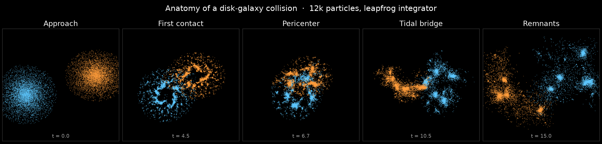
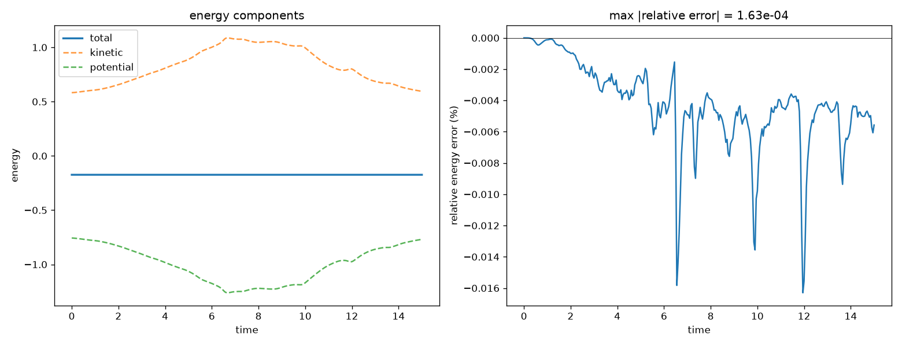
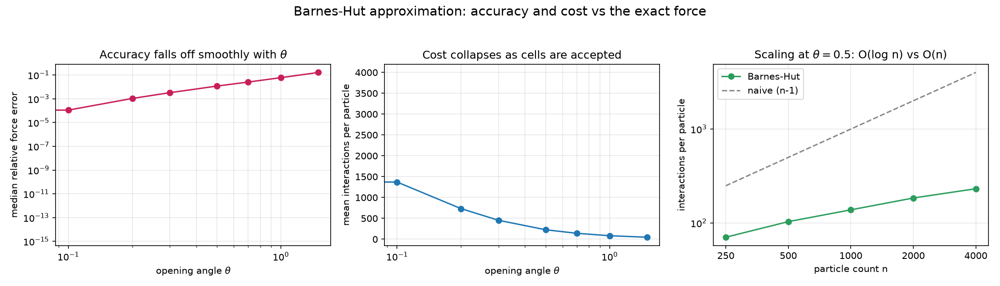
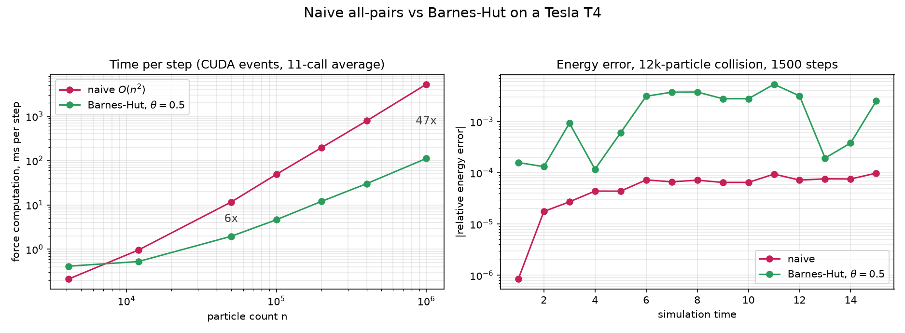

# nbodyssey

[](https://github.com/SamGabriel-Here/nbodyssey/actions/workflows/build.yml)


[](LICENSE)

A GPU-accelerated N-body simulator for galaxy collisions, written in CUDA C++.
Two disk galaxies are seeded with realistic rotation curves, released toward each
other, and integrated forward under mutual gravity. Particle state lives on the
GPU for the whole run; frames are dumped to disk and rendered offline.

The point of the project is the GPU work: a naive all-pairs force kernel with
shared-memory tiling first, then a Barnes-Hut tree code, with timing and energy
diagnostics built in so the optimization story is measurable rather than
asserted.


*Two disk galaxies on a grazing encounter, colored by their galaxy of origin.
12k particles integrated with leapfrog under softened gravity; the pass strips
material into tidal tails and bridges before the cores fall back together.*



*The same run frozen at five moments: the disks approach, interpenetrate at first
contact, reach closest approach at pericenter, stretch a tidal bridge between the
separating cores, and settle into disrupted remnants.*

## Status

Both force modules are complete and benchmarked on hardware: the naive kernel
sustains ~4 TFLOP/s on a Tesla T4, and the Barnes-Hut tree code overtakes it
from ~12k particles up to a **47x speedup at one million** — with the `theta=0`
exactness gate passing on device first. See the
[performance writeup](docs/PERFORMANCE.md). The one flagged optimization still
open is a warp-cooperative tree traversal.

Milestones:

- [x] Repo, build system, architecture, benchmarking harness scaffold
- [x] Initial-condition generator (two exponential disks)
- [x] Naive O(n^2) force kernel with shared-memory tiling
- [x] Leapfrog (kick-drift-kick) integrator
- [x] CUDA-event kernel timing + energy-vs-time log
- [x] Frame dumps + offline matplotlib renderer
- [x] CPU reference integrator + energy-conservation validation
- [x] Barnes-Hut approximation validated on a CPU oracle
- [x] GPU Barnes-Hut module (Karras LBVH + CUB radix sort), compiling in CI
- [x] GPU session: `--compare-forces` gate passed, naive-vs-BH benchmarked (T4)
- [x] Performance writeup comparing the two force modules
- [ ] Warp-cooperative traversal (the measured next optimization)

## Validation

Because the state is single precision, correctness is not obvious, so the physics
is pinned two ways.

A CPU reference integrator (`scripts/reference_nbody.py`) implements the same
force law, kick-drift-kick scheme, and energy diagnostic in NumPy. Running a full
two-galaxy collision and tracking total energy gives the plot below: kinetic
energy peaks at pericenter as the disks fall together, the potential well deepens
in step, and total energy stays flat. The relative energy error stays bounded
within about 0.02% across the encounter and oscillates rather than drifting --
the signature of a symplectic integrator.



The reference also doubles as a GPU-free way to exercise the whole pipeline: it
writes frames and energy logs in the same on-disk formats the CUDA path uses, so
the renderer and downstream tooling are validated end to end. The GPU kernels are
written to mirror the reference and are compiled in CI (`nvcc` targets a device
architecture without needing a physical GPU on the runner).

The Barnes-Hut tree approximation is pinned the same way, ahead of the GPU port.
A CPU oracle (`scripts/barnes_hut_reference.py`) builds the octree, computes the
cell centers of mass, and evaluates the softened force with the opening-angle
criterion, then checks it against the exact all-pairs force. At `theta = 0` no
cell is ever accepted and the result matches the exact force to round-off
(~1e-15), confirming the traversal and center-of-mass bookkeeping; as `theta`
grows, the force error rises smoothly while the interactions per particle
collapse from O(n) toward O(log n). At the usual `theta = 0.5` that is roughly a
1% median force error for an ~18x cut in force evaluations.



The GPU tree code itself is tested in CI, not just compiled: a line-for-line
CPU mirror of its Morton encoding, Karras radix-tree build, centers-of-mass
pass, and stack traversal (`scripts/lbvh_check.py`) runs on every push and
asserts that the tree is well formed (including under duplicate keys), that
`theta = 0` reproduces the exact force to round-off, and that the traversal
stack stays far below the depth limit hard-coded in the kernels.

## Performance

Measured on a Tesla T4, timing the full force computation with CUDA events —
for Barnes-Hut that includes rebuilding the tree every step:



| n | naive | Barnes-Hut (theta = 0.5) | speedup |
|---:|---:|---:|---:|
| 12,000 | 0.95 ms | 0.53 ms | 1.8x |
| 100,000 | 48.9 ms | 4.62 ms | 10.6x |
| 1,000,000 | 5,269.9 ms | 111.6 ms | **47.2x** |

The naive kernel is a real baseline — ~204 Ginteractions/s, about half the
T4's fp32 peak — and still wins below ~8k particles, where tree overhead and
traversal divergence outweigh asymptotics. From 12k up the tree pulls away.
Tree construction is essentially free (~3 ms of the 112 ms at 1M); 97% of
Barnes-Hut time is traversal, which is what the planned warp-cooperative
version attacks. Full analysis, phase breakdowns, and the theta accuracy/cost
dial: [docs/PERFORMANCE.md](docs/PERFORMANCE.md).

## Architecture

The design is fixed up front so the force computation can be swapped without
touching the rest of the code.

**Data resident on the GPU.** The host builds the initial conditions, uploads
them once, and thereafter only copies particle positions back when it is time to
write a frame. Nothing about the integration touches host memory.

**Structure-of-arrays layout.** Positions and velocities are stored in separate
arrays rather than an array of particle structs, so memory accesses across a warp
are coalesced. Position and mass are packed together as a `float4` (`x, y, z, m`);
velocity is a `float4` (`vx, vy, vz, unused`). Mass rides in the position array
because the force kernel needs mass and position together and nothing else on the
same access.

**Single precision.** All particle state is `float`. Single precision is the
right trade for throughput on the target hardware; the cost is energy drift,
which is exactly what the energy diagnostic is there to catch.

**Leapfrog integrator.** Kick-drift-kick leapfrog, which is symplectic and
time-reversible, so total energy oscillates around a constant rather than
drifting secularly. This is what makes single precision defensible.

**Softened gravity.** A softening length `epsilon` is added in quadrature to the
pairwise separation so that close encounters do not produce singular forces and
blow up the integrator. This is standard for collisionless disk simulations where
the particles model a smooth mass distribution rather than real point stars.

**Force computation is a swappable module.** Everything above is stable across
force implementations, and the module is picked at runtime with
`--force naive|bh`. The naive all-pairs kernel gives each thread one target
particle and streams blocks of source particles through shared memory (tiling)
to cut global-memory traffic. The Barnes-Hut module rebuilds its tree on the
device every step: a bounding-box reduction, 63-bit Morton codes, a CUB radix
sort, and a Karras-style parallel radix-tree build, then a bottom-up
centers-of-mass pass and a per-particle stack traversal that treats any node
whose size-to-distance ratio is under the opening angle `--theta` as a single
point mass — O(n^2) becomes O(n log n). Since both modules implement the same
softened force law, `theta = 0` must reproduce the naive forces to float
round-off, and `--compare-forces` runs both on the same state to check exactly
that on device. Each tree phase is timed separately so the writeup can show
where the time goes.

**Offline visualization.** The simulator does not render. It writes particle
positions per frame to disk in a simple binary format; a separate Python script
turns those frames into images or an animation. Rendering is decoupled from the
simulation so neither constrains the other.

## Benchmarking

Timing and correctness instrumentation are part of the simulator from the start,
not bolted on later:

- **Kernel timing** with CUDA events around the force kernel, reported per step
  and aggregated, so the naive-vs-Barnes-Hut comparison is a measured speedup.
- **Energy log** writing total kinetic + potential energy versus simulation time.
  A correct symplectic integrator keeps this bounded; a bug shows up as drift or
  a blowup.

Logs land in `benchmarks/`.

## Repository layout

```
src/         CUDA kernels and host driver (forces, integrator, energy, main)
scripts/     IC generator, CPU reference integrator, and renderers (Python)
benchmarks/  timing and energy logs
docs/        binary-format notes (FORMATS.md), figures, and the perf writeup
```

On-disk binary layouts (initial conditions and frame dumps) are documented in
[docs/FORMATS.md](docs/FORMATS.md).

## Quickstart (no GPU required)

The CPU reference integrator runs the same physics in NumPy and writes the same
on-disk formats, so the entire pipeline — including the animation above — can be
reproduced without CUDA hardware.

```
# set up the Python tooling
python -m venv .venv && source .venv/bin/activate
pip install -r scripts/requirements.txt

# generate two colliding disk galaxies
python scripts/generate_ic.py --particles 12000 --out ic.bin

# integrate on the CPU reference (this is what produced the figures above)
python scripts/reference_nbody.py --ic ic.bin --steps 1500 --dump-every 5 --out frames/

# render the frames to a movie (pass a directory instead of an .mp4 to keep PNGs)
python scripts/render.py --frames frames/ --out collision.mp4

# plot energy conservation from the log the run wrote
python scripts/plot_energy.py --log benchmarks/energy_reference.csv --out energy.png
```

## Building the GPU version

The CUDA path targets a Linux machine with the CUDA Toolkit and a recent CMake.
macOS has no CUDA support, so the code is developed on macOS but built and run on
a GPU host. The command-line interface matches the reference integrator, so the
same IC file and flags work with either.

```
cmake -B build -DCMAKE_BUILD_TYPE=Release
cmake --build build -j

# naive all-pairs kernel
./build/galaxy_sim --ic ic.bin --steps 1500 --dump-every 5 --out frames/

# Barnes-Hut tree code at the usual opening angle
./build/galaxy_sim --ic ic.bin --steps 1500 --force bh --theta 0.5 --out frames/

# check the two force modules against each other on the current GPU
./build/galaxy_sim --ic ic.bin --compare-forces --theta 0
```

Set `-DCMAKE_CUDA_ARCHITECTURES=<sm>` to match the target GPU (for example `86`
for Ampere, `89` for Ada). The run reports force timing on exit — plus a
per-phase breakdown of the tree pipeline under `--force bh` — and writes an
energy log alongside the frames.

The entire benchmark session is scripted: `bash scripts/gpu_bench.sh` on any
CUDA machine (a Colab T4 works) builds, runs the `--compare-forces` gate, sweeps
naive vs Barnes-Hut across particle counts, and leaves the results in
`benchmarks/gpu_results.csv`.

## License

MIT. See [LICENSE](LICENSE).
