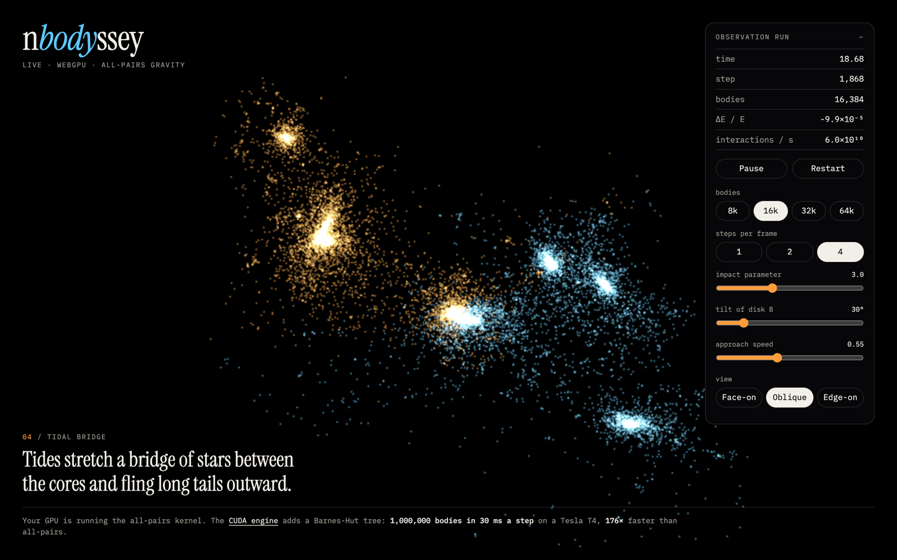
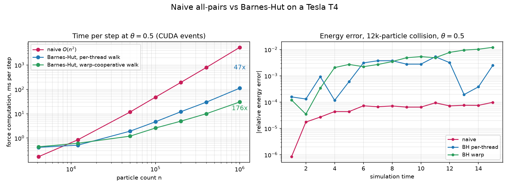
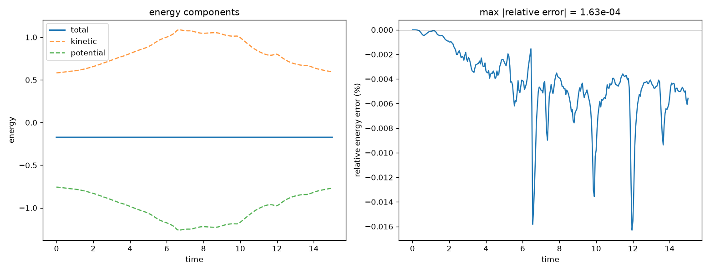
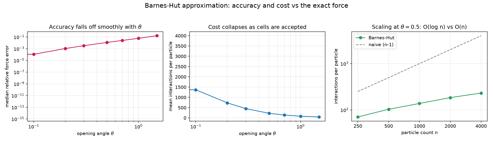
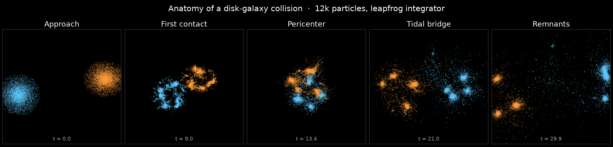

# nbodyssey

[](https://github.com/SamGabriel-Here/nbodyssey/actions/workflows/build.yml)


[](LICENSE)

Two disk galaxies collide under their own gravity, on a GPU, in two places: live
in your browser through WebGPU, and at a million bodies through a CUDA engine
with a Barnes-Hut tree.

**[Run it live → nbodyssey.vercel.app](https://nbodyssey.vercel.app)**

[](https://nbodyssey.vercel.app)

*The browser version mid-encounter: 16,384 bodies stepped by your own GPU, with
the energy drift and interaction rate measured as it runs. Drag to orbit,
scroll to zoom, and change the orbit with the sliders; the caption follows the
encounter from approach through pericenter to the tidal bridge.*

## Two engines, one physics

| | browser (`web/`) | CUDA (`engine/`) |
|---|---|---|
| runs on | any WebGPU GPU: laptops, phones | NVIDIA GPUs (benchmarked on a Tesla T4) |
| force | tiled all-pairs, O(n²) | tiled all-pairs, or a Barnes-Hut LBVH, O(n log n) |
| scale | 8k to 64k bodies, live at 60 fps | up to 1,000,000 bodies, offline frames |
| output | rendered from the GPU buffer, live | frame dumps, rendered offline |

Both use the same softened force law, the same kick-drift-kick leapfrog, the
same units and initial conditions, and the same energy diagnostic. The WGSL
kernel is a line-for-line port of the CUDA one: each workgroup streams 256
source bodies through workgroup memory, every thread reuses them, then the tile
advances. On an Apple M2 it sustains about 65 billion interactions a second,
and its energy drift over a full encounter (~10⁻⁴) matches the CUDA engine's.


*The CUDA engine's own run: 100,000 particles on a Tesla T4 with the
warp-cooperative Barnes-Hut walk (2,000 leapfrog steps in 5.2 seconds of GPU
time), rendered offline from the frame dumps.*

## Performance

Measured on a Tesla T4, timing the whole force computation with CUDA events.
For Barnes-Hut that includes rebuilding the tree every step:



| n | naive | BH per-thread | BH warp-cooperative | best speedup |
|---:|---:|---:|---:|---:|
| 12,000 | 0.85 ms | 0.51 ms | 0.61 ms | 1.7x |
| 100,000 | 47.8 ms | 4.66 ms | 2.59 ms | 18.5x |
| 1,000,000 | 5,324.2 ms | 112.1 ms | 30.3 ms | **176x** |

The naive kernel is a real baseline: ~204 billion interactions a second, about
half the T4's fp32 peak, and it still wins below ~8k particles, where tree
overhead and divergence outweigh the asymptotics. From 12k up the tree pulls
away. Building the tree costs ~3 ms at 1M; the traversal is everything, and
that is where the optimization landed: the warp-cooperative walk does ~2x more
arithmetic per lane, but each warp follows one uniform, coalesced path, and it
beats the divergent per-thread walk by 3.7x at a million particles. Phase
breakdowns, the theta accuracy/cost dial and an energy caveat for the warp walk
are in [docs/PERFORMANCE.md](docs/PERFORMANCE.md).

## Validation

Single precision makes correctness non-obvious, so the physics is pinned from
several sides.

- **A CPU reference integrator** (`tools/reference_nbody.py`) implements the
  same force law, integrator and energy diagnostic in NumPy. Over a full
  collision, total energy stays flat while kinetic and potential energy trade
  places at pericenter, and the relative error stays bounded near 0.02%,
  oscillating instead of drifting. That is the signature of a symplectic
  integrator.

  

- **A CPU Barnes-Hut oracle** (`tools/barnes_hut_reference.py`) builds the
  octree and checks the tree force against the exact one. At `theta = 0` they
  agree to round-off (~1e-15); at the usual `theta = 0.5` the median force
  error is ~1% for an ~18x cut in force evaluations.

  

- **The GPU tree code is tested in CI, not just compiled.** A line-for-line CPU
  mirror of its Morton encoding, Karras radix-tree build, centers-of-mass pass
  and both traversals (`tools/lbvh_check.py`) runs on every push. It asserts
  the tree is well formed under duplicate keys, that `theta = 0` reproduces the
  exact force, and that the traversal stack stays far below its fixed depth.
- **On device**, `--compare-forces` runs naive and Barnes-Hut on the same state.
  At `theta = 0` they agreed to a mean relative difference of 1.7e-5 on the T4,
  which is float32 round-off.



*The encounter at five moments, from a 12k-particle CPU reference run.*

## Architecture

**State lives on the GPU.** Initial conditions are uploaded once. The CUDA
engine copies positions back only to write a frame; the browser never copies
them back for drawing, because the renderer reads the same storage buffer the
integrator writes. Four times a second, a diagnostics pass copies the per-body
energies and positions back, and the CPU sums them into total energy and each
galaxy's center of mass.

**Structure of arrays, packed.** Position and mass travel together as one
`float4` (`x, y, z, m`), velocity as another, so a warp's loads coalesce and the
force loop gets mass with position in a single access.

**Leapfrog, single precision.** Kick-drift-kick is symplectic and
time-reversible, so energy oscillates around a constant instead of drifting.
That is what makes float32 defensible, and the energy log is there to prove it.

**Softened gravity.** A softening length `eps` is added in quadrature to every
separation, so close encounters stay finite. The particles model a smooth
stellar disk, not individual stars.

**A swappable force module.** In the CUDA engine, `--force naive|bh` picks the
force computation at runtime without touching the rest. The Barnes-Hut module
rebuilds a Karras LBVH every step: bounding box, 63-bit Morton codes, a CUB
radix sort, a parallel radix-tree build, a bottom-up centers-of-mass pass, then
a stack traversal that treats any node under the opening angle `--theta` as a
point mass. Each phase is timed separately.

**Light, not dots.** The browser draws each body as a soft additive sprite into
a half-float target and tone-maps the result, so dense cores saturate to
white-hot instead of clipping and the faint tidal tails stay visible.

## Repository layout

```
engine/      CUDA engine: naive and Barnes-Hut force modules, integrator, energy, host driver
web/         the live browser version: WGSL kernels, renderer, initial conditions, UI
tools/       Python: IC generator, CPU reference integrator, Barnes-Hut oracle,
             LBVH mirror, renderers and plots
benchmarks/  T4 timing and energy logs
docs/        performance writeup, binary formats, figures
```

## Running it

**In a browser.** The `web/` folder is static files with no build step:

```bash
python3 -m http.server 8000 -d web
```

Then open `http://localhost:8000` in Chrome, Edge or Safari 26. A run is
encoded in the URL (`?n=32768&b=3&i=30&v=0.55`), so any setup can be shared.
`node --test web/` checks the initial conditions.

**Without a GPU.** The CPU reference runs the same physics in NumPy and writes
the CUDA engine's on-disk formats, so the whole offline pipeline works anywhere.
The stage and energy figures above came from it.

```bash
python -m venv .venv && source .venv/bin/activate
pip install -r tools/requirements.txt
python tools/generate_ic.py --particles 12000 --out ic.bin
python tools/reference_nbody.py --ic ic.bin --steps 1500 --dump-every 5 --out frames/
python tools/render.py --frames frames/ --out collision.mp4
python tools/plot_energy.py --log benchmarks/energy_reference.csv --out energy.png
```

**On a CUDA machine.** The engine needs Linux, the CUDA Toolkit and CMake 3.20+.
macOS has no CUDA, so it is developed there and built on a GPU host.

```bash
cmake -B build -DCMAKE_BUILD_TYPE=Release -DCMAKE_CUDA_ARCHITECTURES=75
cmake --build build -j
./build/galaxy_sim --ic ic.bin --steps 1500 --dump-every 5 --out frames/
./build/galaxy_sim --ic ic.bin --steps 1500 --force bh --traverse warp --theta 0.5 --out frames/
./build/galaxy_sim --ic ic.bin --compare-forces --traverse warp --theta 0
```

Set `CMAKE_CUDA_ARCHITECTURES` to match the GPU (`75` Turing, `86` Ampere, `89`
Ada). Each run reports force timing on exit, adds a per-phase breakdown under
`--force bh`, and writes an energy log next to the frames. The whole benchmark
session is scripted: `bash tools/gpu_bench.sh` on any CUDA machine (a free
Colab T4 works) builds, runs the `theta = 0` gate for both tree walks, sweeps
the force modules across particle counts, and writes `benchmarks/`.

Binary layouts for initial conditions and frame dumps are in
[docs/FORMATS.md](docs/FORMATS.md).

## License

MIT. See [LICENSE](LICENSE).
